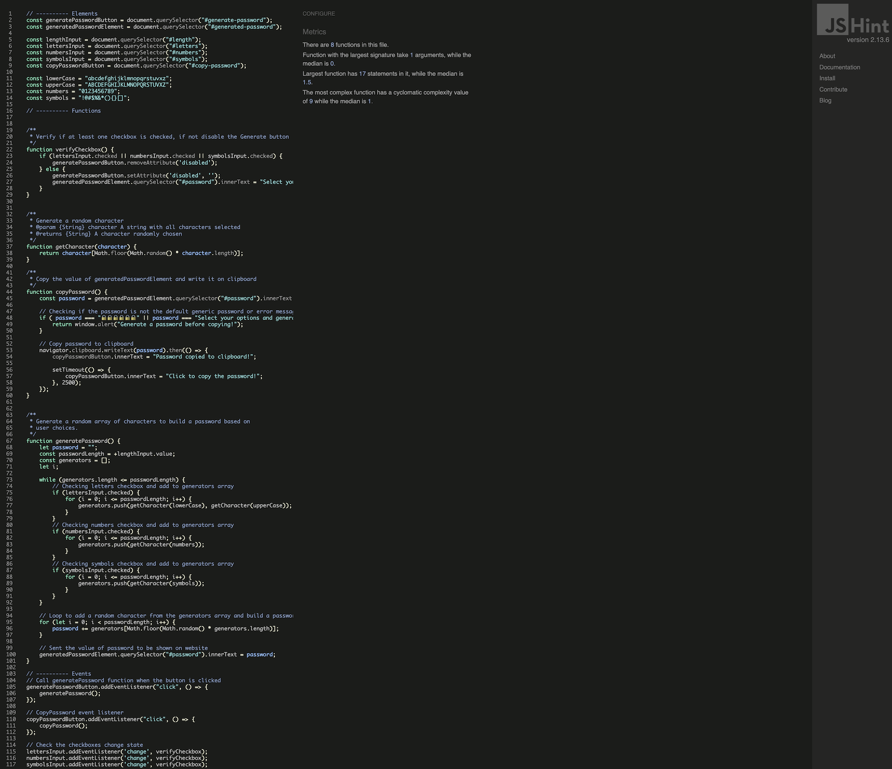
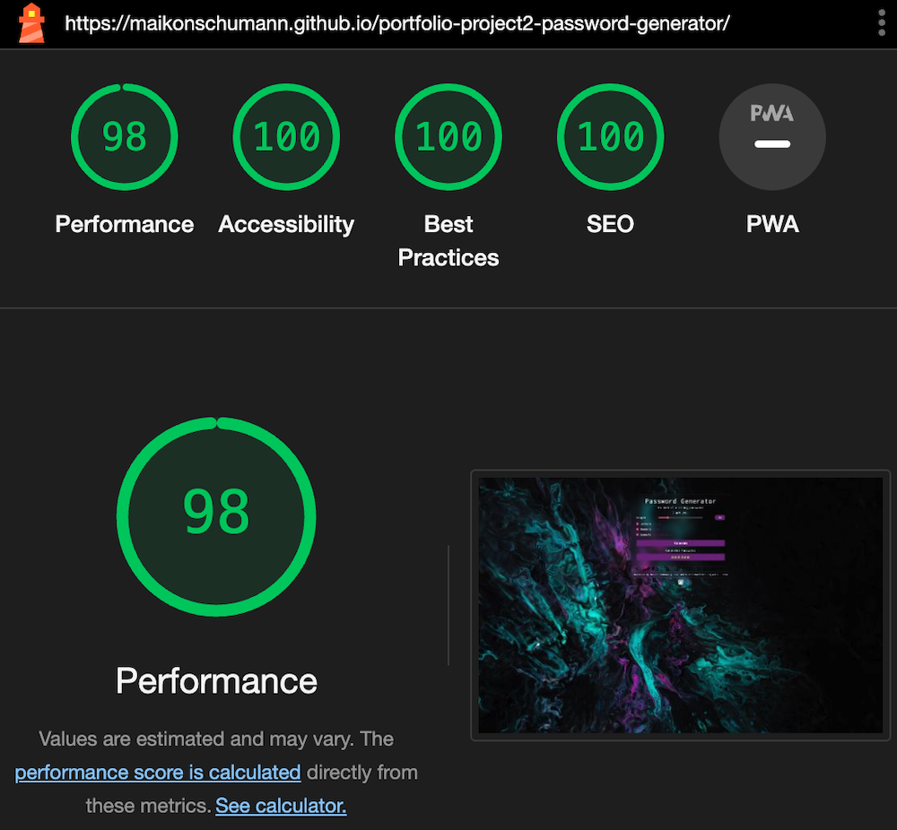
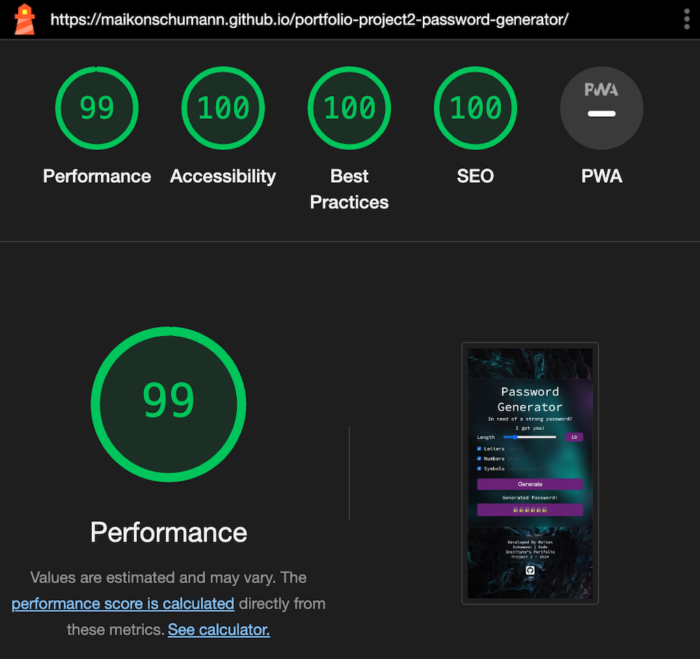

# Password Generator

Welcome to Password Generator, where creating secure passwords is a breeze. We prioritize simplicity without compromising on security, making it effortless for you to fortify your online presence.

Your trusted website for Strong, Stress-Free Passwords!

## Demo

A live demo can be found [here](https://maikonschumann.github.io/portfolio-project2-password-generator/).

- - - 

# Contents
* [Languages Used](#languages-used)
* [User Experience](#user-experience-ux)
* [Design](#design)
  * [Wireframes](#wireframes)
  * [Features](#features)
  * [Future Implementations](#future-implementations)
  * [Color Scheme](#color-scheme)
  * [Typography](#typography)
  * [Icons](#icons)
* [Deployment](#deployment)
  * [Run locally](#run-locally)
  * [Testing](#testing)
* [Credits](#credits)
* [Acknowledgements](#acknowledgements)

- - -

# Languages Used
* HTML5
* CSS3
* JavaScript

- - - 

# User Experience (UX)

## The ideal user profile:
For those seeking a seamless password creation experience:
 *   Easily generate secure passwords with our no-nonsense interface. No complications, just straightforward password creation. 
 *   Mix and match letters, numbers, and symbols according to your preferences.
 *   Your digital safety is our priority.
 *   Copy your password with a single click, making your experience smooth and hassle-free.

## User stories

### First Time Visitor Goals
 * As a new visitor to the website, I expect to easily to understand the main purpose of the site and navigate without complications. 
 * I can find what I search efficiently.
 * Easily create a secure password with our friendly interface.
 * Mix and match letters, numbers, and symbols to craft a password that's uniquely yours.
 * Experience the simplicity of copying your generated password with just one click.

### As a Frequent User 
 * Generate passwords swiftly with minimal effort, leveraging the familiarity of the user-friendly interface.
 * Explore and utilize advanced customization options for creating varied passwords tailored to different security needs.

- - -

# Design

## Wireframes:

* Index Page:

## Features

The website is a single-page experience: the index page. Design to achieve the user needs, easily to understand and straight to the point. Navigate easily through the **Main Section** and find additional information in the friendly **Footer** below.

# **Index page**

The **Home** page is divided into only 2 sections, *Main Section* and *Footer*.

## Main Section

The *Main Section* features a *container*, explore a tailored container where users can choose from a variety of options to customize password generation. Meticulously crafted to elevate user experience and make a lasting impact.

- - - 

## Footer 

The footer consists of a brief text containing developer information and an icon linking to the developer's GitHub profile.

- - -

# Future Implementations

Further development of the website, including the addition of more pages and improved responsiveness, will necessitate additional time and expertise.

- User data base - 
To enhance user functionality, implement a user database feature where users can securely store and retrieve generated passwords as needed.

- FAQ page - 
Develop a comprehensive FAQ page to address common user queries, reducing the need for direct support and improving user satisfaction.

- Blog - 
Introduce a blog section with relevant articles to build user confidence, and increase overall site traffic.

- - - 

# Color Scheme

The color scheme was crafted around a background image to provide a modern and impactful user experience.

- - - 

# Typography

The website utilizes a singular font, specifically **Source Code Pro** from **Google Fonts**, maintaining a uniform and cohesive typographic style.

- - - 

# Icons
The website's icons are sourced from [Font Awesome](https://fontawesome.com/icons), and are covered under a free license.

- - - 

# Deployment

The site is hosted on GitHub Pages, deployed directly from the master branch. Automatic updates to the deployed site occur with each new commit to the main branch. It's essential that the landing page is named index.html for correct deployment on GitHub Pages.

To deploy the page on GitHub Pages from its [GitHub repository](https://maikonschumann.github.io/portfolio-project2-password-generator), the following steps were executed: 
1. Login or Sign Up to GitHub.
2. Open the project repository.
3. Select **Settings** from the top menu.
4. Click on "Pages" in the left hand navigation panel.
5. In the "Source" section, choose the branch to deploy (Main for newer repositories, Master for older ones).
6. Select the deployment folder, typically "/root".
7. Click "Save" and wait for the deployment process to complete.
8. Your URL will be shown above the "Source" section.

## Run locally
**Fork:**
1. Login or Sign Up to GitHub.
2. Open the project [repository](https://maikonschumann.github.io/portfolio-project2-password-generator).
3. Click the Fork button in the top right corner.

**Clone:**
1. Login or Sign Up to GitHub.
2. Open the project [repository](https://maikonschumann.github.io/portfolio-project2-password-generator).
3. Click on the "Code" button, choose your preferred cloning method (HTTPS, SSH, or GitHub CLI), and copy the provided link.
4. Open your preferred code editor's terminal and navigate to the desired location for the cloned directory.
5. Type 'git clone' in the terminal, paste the link from step 3, and press enter.

- - -

# Testing 
The site is designed to smoothly operate, making it easy for users to achieve their goals. Chrome development tools were utilized to catch and fix any issues during the development process. Performance testing was conducted through both manual and automated methods.

1. All website buttons perform as expected when clicked.

2. GitHub Icon link opens in new page.

## Functionality

### Validators
1. Validation for this project was conducted using W3C Markup Validator, W3C CSS Validator Services, and Jshint to ensure the absence of syntax errors.

  * Index Page

  * CSS Page

  * JS Hint

2. Lighthouse within the Chrome Developer Tools are used to test performance, accessibility, best practices and SEO of the Password Generator Website.
 * Index Page Desktop

 * Index Page Mobile

## Usability
**TEST** | **ACTION** | **EXPECTATION** | **RESULT** 
----------|----------|----------|----------
Home page	| Size to 320px using Chrome Dev Tools	| Elements look good at 320px | Works as expected
Home page	| Size to 1920px using Chrome Dev Tools | Elements look good at 1920px | Works as expected
Password length input | Select a range between 4 to 35 | Should not allow values outside the specified range | Works as expected
Letters input | Click to add as an option to password | If checked, the option is added to the random password | Works as expected
Numbers input | Click to add as an option to password | If checked, the option is added to the random password | Works as expected
Symbols input | Click to add as an option to password | If checked, the option is added to the random password | Works as expected
Generate button | Click to generate password | If at least one input is checked, it generates the password. If none of the inputs are checked, the button is disabled | Works as expected
Generated password | Shows the generated password | When hovered, shows the option to copy the password to the clipboard. If no password is generated, an alert prompts the user to generate one before copying | Works as expected
Copy Password button | Click to copy the password | On click, copy the generated password to the clipboard. If no password is generated, prompt the user to generate one before attempting to copy | Works as expected
GitHub icon | Link to developer's profile on GitHub | Opens in a new page | Work as expected

## Compatibility 
The website is optimized to display correctly on a variety of browsers and screen sizes. The compatibility was checked by testing on Chrome, Firefox, Safari, and Edge.

## Responsiveness
Checked responsiveness using Chrome DevTools on various screens like iPhone 5 (320px wide) and 5k iMac Pro (5120x2880px). Used media queries for more responsiveness.

- - - 

# Credits

I started this project based on my own needs, this is not a copy. 

The background image on the website is from Unsplash under a free license agreement.
* Image background link can be found [here](https://unsplash.com/pt-br/fotografias/arte-abstrata-verde-e-rosa-z7prq6BtPE4).

The Favicon is from Icon Archive under a free license agreement.
* The FavIcon link can be found [here](https://www.iconarchive.com/show/papirus-apps-icons-by-papirus-team/preferences-desktop-user-password-icon.html).

### Below are some YouTube tutorials where I searched expertise to fulfill specific tasks.

Random password generator tutorial.
* The Youtube tutorial link can be found [here](https://www.youtube.com/watch?v=rqwPKZdOO6o).

The Copy Button.
* The Copy button was inspired by [this](https://www.youtube.com/watch?v=Uk-uYmC3w5Y) tutorial.

- - -

# Acknowledgements
* I appreciate my family's patience as I dedicate considerable time to coding.

* My Mentor Lauren-Nicole Popich for continuous helpful feedback.